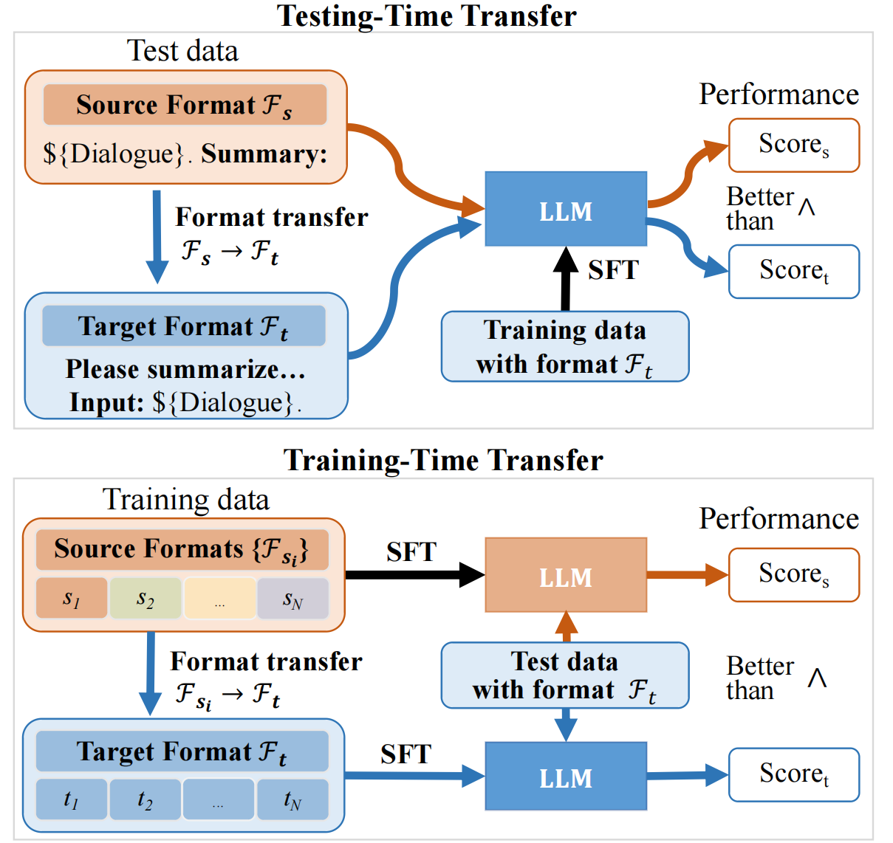
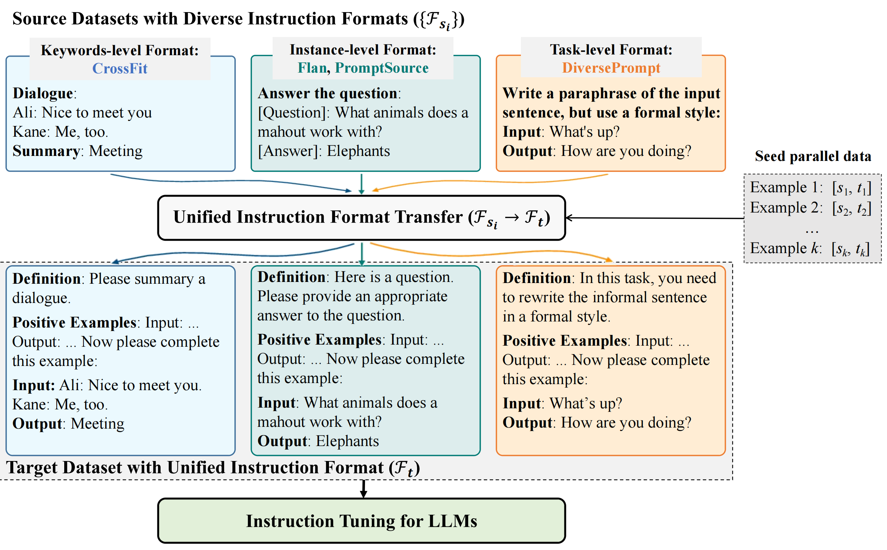

<div align="center">

<h1>Unified Instruction Tuning</h1>

</div>

✨ This is the implementation of the paper [Exploring Format Consistency for Instruction Tuning](https://arxiv.org/abs/2307.15504).


<!-- *Read this in [中文](README_zh.md).* -->

---


## Quick links

- [Quick links](#quick-links)
- [Overview](#overview)
- [Data and Models](#data-and-models)
- [Requirements](#requirements)
- [Format Transfer](#format-transfer)
  - [Usage](#usage)
- [Perplexity Annotation](#perplexity-annotation)
  - [Usage](#usage)
- [Citation](#citation)


## Overview
<!--  -->


In this work, we propose a framework named “Unified Instruction Tuning” (UIT) for automatic format transfer among different instruction tuning datasets such as PromptSource, FLAN and CrossFit. With the framework, we:
- Demonstrate the necessity of maintaining format consistency in instruction tuning;
- Improve the generalization performance on unseen instructions on T5-LM-xl;
- Provide a novel perplexity-based denoising method to reduce the noise of automatic format transfer to make the UIT framework more practical and a smaller offline model based on GPT-J that achieves comparable format transfer capability to OpenAI APIs to reduce costs in practice. 
Further analysis regarding variations of targeted formats and other effects is intended. The data and trained models are now available.

## Data and Models

All the data we use in our main experiments are available [here](https://drive.google.com/drive/u/0/folders/12MepDWmQA3Wm8wpfMzeYHLFg1YwlcUGJ):
- `niv2_as_target`: Contains Flan, PromptSource, DiversePrompt and CrossFit data transferred into Ni-v2's format.
- `flan_as_target`: Contains the Ni-v2 data transferred into Flan's format.

Checkpoints we use in our local transfer experiments are available [here](https://drive.google.com/drive/u/0/folders/12MepDWmQA3Wm8wpfMzeYHLFg1YwlcUGJ).

## Requirements

To run our local transfer and ppl annotation code, please install all the dependency packages by using the following command:

```bash
pip install -r requirements.txt
```

**NOTE**: The local transfer model is based on [ModelCenter](https://github.com/OpenBMB/ModelCenter). We have extracted the necessary codes under `modelcenter/`, more details about modelcenter can refer to the original repository.

## Format Transfer

This part of code finetunes a GPT-J model to perform instruction format transfer task. The framework has no diference with other script of other causal LM fine-tuning scripts. This part adopts the code from Model Center (hyperlink). You may use any scripts you are familiar with for the same functionality.


### Usage

1. Download the configuration and checkpoint from model center or from our links. The files should contain `added_tokens.json`, `tokenizer_config.json`, `config.json`, `pytorch_model.pt`, `tokenizer.json`, `merges.txt`, `special_tokens_map.json`, `vocab.json`.
2. prepare dataset following the example in `./data`.
3. implement the dataset in model_center/dataset/gpt2dataset
4. Modify the paths and parameters in main.py and scripts/run_local_transfer.sh
5. run in the linux commandline:
```bash
bash scripts/run_local_transfer.sh
```
6. Examine the results in the 'res' directory.


## Perplexity Annotation

This part of code evaluate the level of machine-generated instruction by perplexity.


### Usage

To use the code for perplexity annotation, you may follow these steps:

1. Download the configuration and checkpoint from model center or from our links. The files should contain `added_tokens.json`, `tokenizer_config.json`, `config.json`, `pytorch_model.pt`, `tokenizer.json`, `merges.txt`, `special_tokens_map.json`, `vocab.json`.
2. Prepare tasks with different instructions following the examples in /data/tasks and /data/splits.
3. Modify the paths and parameters in main.py and scripts/run_ppl_annotation.sh
4. run in the linux commandline:
```bash
bash scripts/run_ppl_annotation.sh
```
5. Examine the results in the 'res' directory.


## Citation

If you find our work useful, please use the following citation: 

```bibtex
@article{liang2023exploring,
  title={Exploring format consistency for instruction tuning},
  author={Liang, Shihao and Zhu, Kunlun and Tian, Runchu and Qin, Yujia and Wang, Huadong and Cong, Xin and Liu, Zhiyuan and Liu, Xiaojiang and Sun, Maosong},
  journal={arXiv preprint arXiv:2307.15504},
  year={2023}
}
```